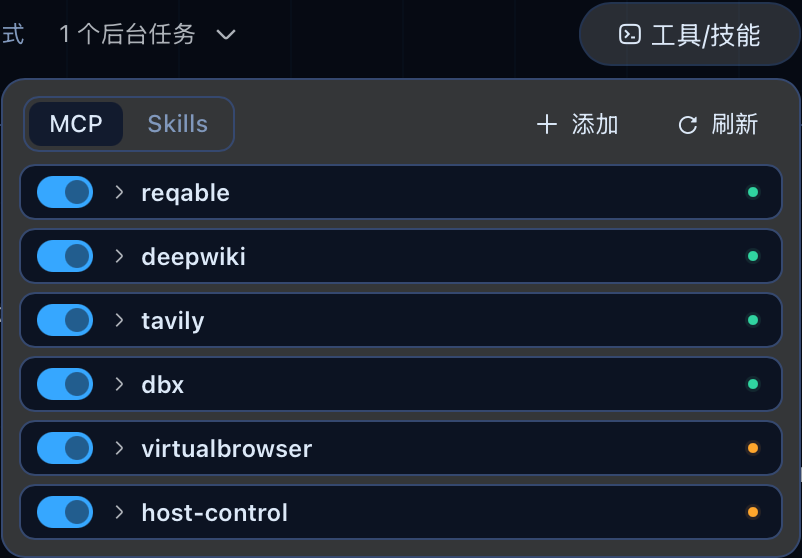
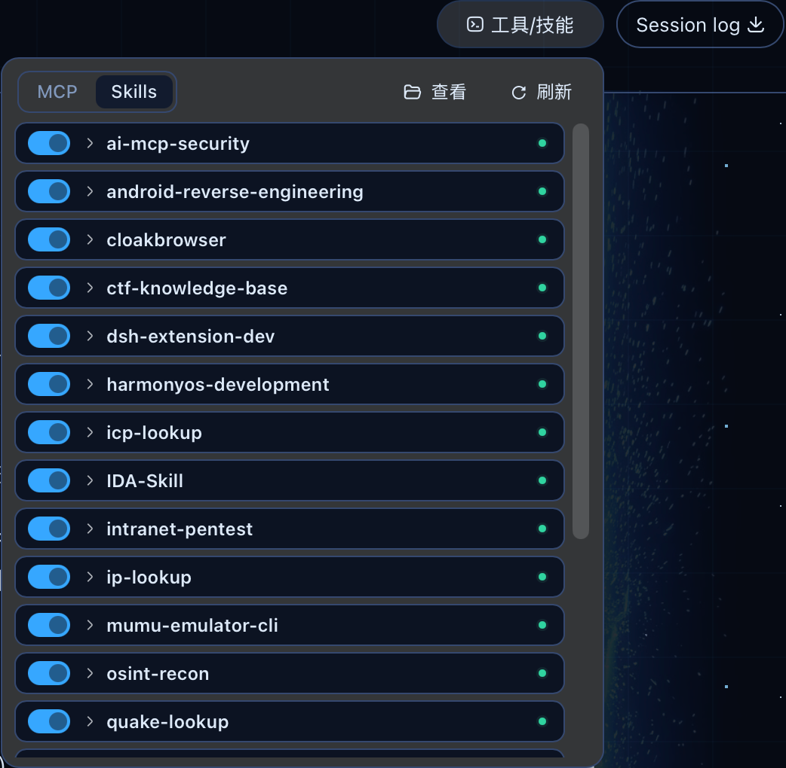

# dsh-mcp-skill-control

  

DeepSeek Harness（DSH）**第三方插件**：在 Web GUI（`dsh web`）会话头部提供一个管理面板——**MCP 服务器**页签（查看连接状态，停用 / 启用 / 重启，新增 / 删除，JSON 导入）与 **Skills** 页签（启停本地技能）。

- **形态**：单包双面插件（Host 半 + Browser 半），独立分发，**零 DSH 源码改动**
- **安装**：`dsh plugin --profile web add <目录或 tgz>`（link 安装，重启持久）
- **持久化**：所有变更写入 profile 的 `cordis.patch.yml`，由 `watchUserPatches` 经 HMR 事务应用——当前进程立即生效，且重启后保持

## 功能一览

| 功能 | 说明 |
|------|------|
| 状态查看 | 列出全部 `@deepseek-ai/dsh-mcp-client` 行：serverName、传输方式、端点、连接状态、已注册工具数与清单 |
| 停用 / 启用 | 写入或移除 `disabled` 覆盖；本插件插入的行就地改写，其他层的行用顶层 override |
| 重启 | 先停后启（崩溃恢复、刷新工具列表）；纯运行时动作，不改持久状态 |
| **新增** | 表单（stdio / streamable-http 双模，含 env、headers、cwd、超时、reconnect）或**粘贴 JSON 导入** |
| **删除** | 从 `cordis.patch.yml` 摘除该行，二次确认弹窗；仅限本 patch 层定义的行 |
| 诊断探测 | `streamable-http` 行不可达时自动发一次 MCP initialize 探测（30s 限频），把"零工具"翻译成可读诊断 |
| **技能控制** | `Skills` 页签列出用户 skill root（`~/.dsh/skills`、`~/.agents/skills`）下的本地技能：一键启用 / 禁用（写入或移除 frontmatter 的 `disable-model-invocation`，Markdown 正文逐字节保留）、文件管理器定位（reveal）；项目级 skill root 刻意不管理 |

## 界面预览





### 状态语义

| 状态 | 含义 |
|------|------|
| `connected` | fiber active 且已注册工具 |
| `connecting` | 正在建立连接（20s 内） |
| `unreachable` | **本插件的判定**：fiber active 但持续 20s 零工具。mcp-client 默认 `failOnStartupError: false`，端点不可达时 fiber 仍为 active，若不做此判定该行会永久显示「连接中」。对 `streamable-http` 会额外发一次 initialize 探测给出诊断文本 |
| `failed` | fiber 进入 failed |
| `disabled` | 已停用 |

状态在每次 `list()` 时从 loader entry 树 + 工具注册表**实时派生**，无缓存镜像——Loader 是唯一生命周期权威。

### JSON 导入支持的格式

- Claude Desktop / Cursor：`{ "mcpServers": { "<name>": { command, args, env } } }`
- OpenCode：`{ "mcp": { "<name>": { type: "local", command: [bin, ...args], environment } } }`
- 裸服务器映射，或带 `name` 字段的单个服务器对象

导入时的自动处理：

- **名称 slug 化**：`"Tavily MCP"` → `Tavily-MCP`（mcp-client 要求 `[A-Za-z0-9_-]{1,32}`）
- **SSE 拦截**：`type: "sse"` 或 `/sse` 结尾的端点会被拒绝并给出说明——DSH 的 mcp-client **只支持 stdio 与 streamable-http**，导入这类端点只会得到一个永远连不上的行。显式声明 `type: "streamable-http"` / `"http"` 可跳过 URL 后缀检查
- **源文档标记停用**（`disabled: true` / `enabled: false`）的条目跳过并标注原因
- 多服务器**顺序导入**（每个 add 都等 loader 挂载，避免并发写同一 YAML 文件互相覆盖）

## 架构

```
Browser（dsh web 页面）
└─ src/client/                      Host（loader 树中 id: mcp-manager）
   ├─ index.ts      slot 注册 + 自适应轮询    └─ src/
   ├─ McpPanel.tsx  面板（primitives 组件）       ├─ index.ts       入口（默认导出服务类）
   ├─ McpAddDialog.tsx 新增/导入对话框            ├─ service.ts     RPC 服务 + 兜底 HTTP + 探测
   ├─ spec-parse.ts 纯解析（表单/JSON 导入）      ├─ inventory.ts   loader 树只读投影
   ├─ store.ts / port.ts / styles.ts / locales.ts ├─ patch-writer.ts YAML AST 编辑
                                                  ├─ shared.ts      共享基元（解循环依赖）
                                                  └─ types.ts       线上词汇（纯类型）
```

### 通信通道（双通道，自动降级）

1. **主通道**：`ctx.connection.rpc.call('/api', 'mcpManager/<method>')`——typert gateway SRC 动态发现，无需生成产物
2. **兜底**：`POST /mcp-manager/api/<method>`——Host 半在 `webServer` 服务上注册的普通 HTTP 路由；仅当 RPC 返回 `invocation-unavailable`（网关未发现命名空间，如旧版 dsh）时启用

### 两条核心设计约束

1. **Loader 是唯一生命周期权威**。每次 `list()` 都重读实时 entry 树与工具注册表，无缓存、无镜像状态；启停通过写 patch 文件让 watcher 事务应用，运行时仅用 `Entry.update()` 对齐漂移。
2. **配置写入走 YAML Document AST**（`yaml` 的 `parseDocument`，与 DSH 自己的 `settings-file` 同一手法），用户注释、键序、`[...]` 内联格式全部保留。已验证：任意增删组合撤销后与原文**字节级一致**。

## 依赖

`yaml`（peer）：`cordis.patch.yml` 的保留注释编辑。它已是 DSH 自身依赖（`settings-file`、`credentials-local`、`skill-filesystem`），profile 运行时可直接解析，无需额外安装。

## 快速开始

```bash
# 快速安装：从 GitHub 拉取源码并自动构建（prepare 钩子），再注册到 web profile
dsh plugin --profile web add https://github.com/shuaihaoV/dsh-mcp-skill-control

# 卸载
dsh plugin --profile web remove @dsh-external/dsh-mcp-skill-control

# 启动后访问：会话头部右上角 "MCP" 胶囊按钮（Session log 左侧）
open http://127.0.0.1:3080
```

> **pnpm 11 构建放行**：git 直装依赖 `prepare` 钩子构建产物，pnpm 的 supply-chain 保护会拦截构建脚本。首次安装若报 `[ERR_PNPM_GIT_DEP_PREPARE_NOT_ALLOWED]`，把报错提示的精确键添加到 `<profile>/pnpm-workspace.yaml` 的 `allowBuilds` 后重跑：
>
> ```yaml
> allowBuilds:
>   '@dsh-external/dsh-mcp-skill-control@https://codeload.github.com/<commit SHA 按报错填写>': true
> ```
>
> 该键包含每次 push 都会变化的 commit SHA，之后更新插件再报错时按新提示同步更新即可。

### 从源码开发

```bash
git clone https://github.com/shuaihaoV/dsh-mcp-skill-control.git
cd dsh-mcp-skill-control

# 本地构建（构建产物 lib/ 不入库；依赖从 bun 全局 dsh 安装解析，可用 DSH_GLOBAL_NM 覆盖）
bash scripts/build.sh

# 装到 web profile（link 模式，改 profile package.json + bundles）
dsh plugin --profile web add .

# 仅类型检查
bash scripts/build.sh --no-emit
```

## 生效方式

| 改动范围 | 生效条件 |
|---|---|
| Browser 半（`lib/client.js`） | 刷新页面（boot manifest 在页面加载时注入） |
| Host 半（`lib/index.js`） | **重启 DSH 进程** |
| `cordis.patch.yml` 内容 | 自动（HMR 事务应用，无需重启） |

## 行为细节

- **轮询节奏**：页面可见时每 5s；存在 `connecting` 行时加速到 2s；页面隐藏时暂停，恢复可见立即刷新
- **操作互斥**：同一 entry 同时只允许一个生命周期操作（`transition-in-flight` 拒绝并发）
- **unstable id 行**：loader 生成的 8-hex 随机 id 每次重启都会重铸，无法被 patch 定位——此类行的启停开关在 UI 中禁用并提示先补稳定 id
- **等待上限**：add 等挂载 5s、启停等 HMR 应用 3s、restart 等 fiber 拆除 8s；add 超时**不回滚**已写入的行（合法配置下次启动会挂载，静默撤销用户写入更糟）

## 已知限制

- 删除仅对**本插件 patch 层插入的行**可用；bundle 层定义的行只能停用（patch 语法没有 delete 操作）
- 不展示、不编辑 `env` / `headers` 的值（密钥泄漏面，刻意排除；`streamable-http` 行不可达时探测会重放行自身 headers 到行自身 URL——与 mcp-client 同一目的地，无新增暴露）
- 状态是轮询快照而非推送（`API_REMOTE_FORWARDED_EVENTS` 是编译期白名单，外部插件事件无法转发到浏览器）
- 无自动化测试目录；验证依赖 `--no-emit` 类型检查 + 浏览器手动验收

## 许可

[MIT](LICENSE) © [shuaihaoV](https://github.com/shuaihaoV)
